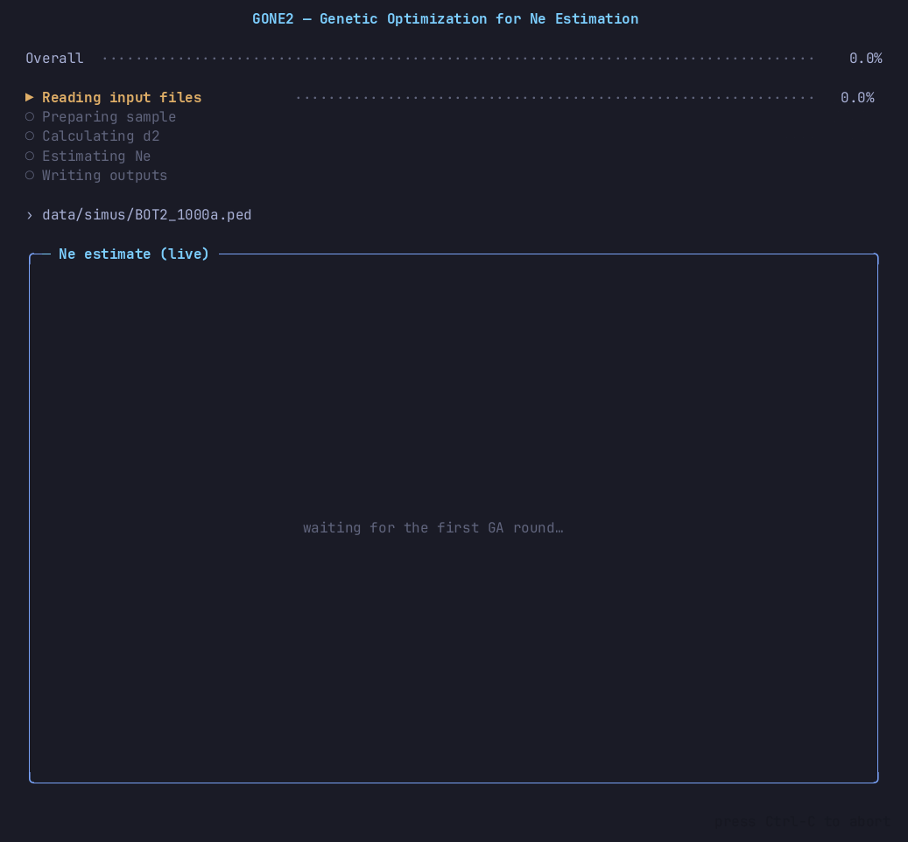
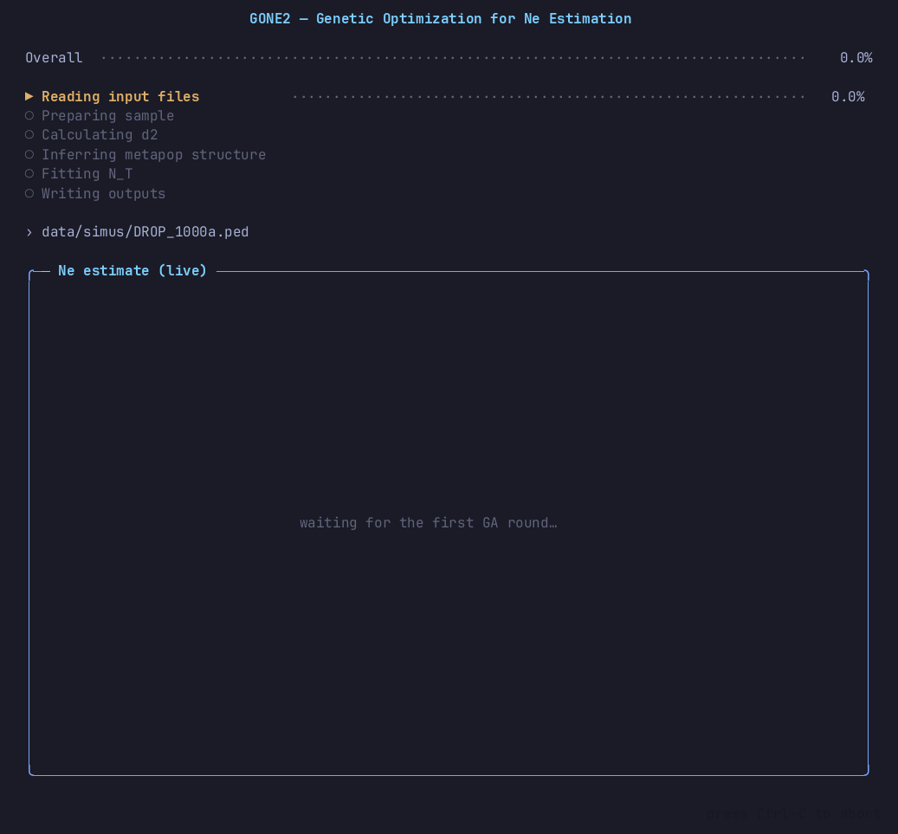
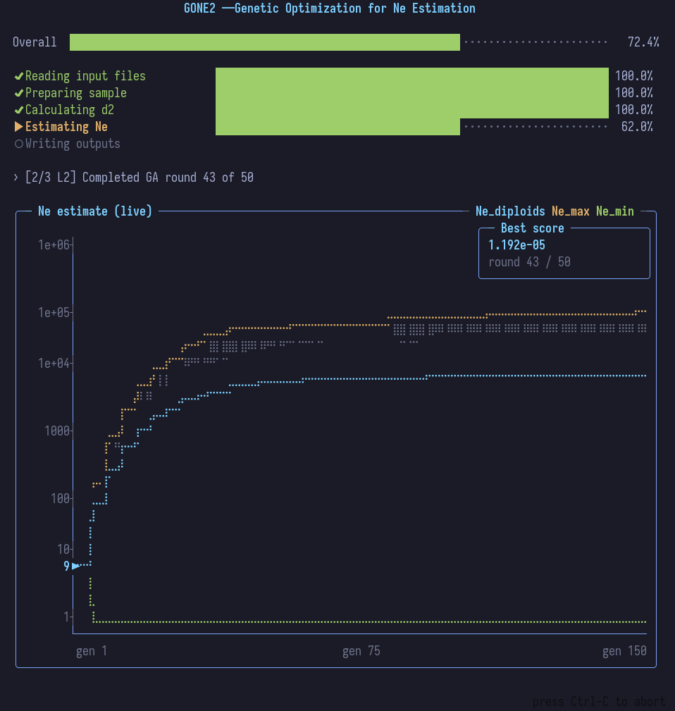

# GONE2
Demographic history from the observed spectrum of linkage disequilibrium



# What's new in this version
This release reworks the Ne-estimation genetic algorithm (GA) and the
metapopulation mode. In brief:

- **Multiple GA runtime** — every analysis runs three complementary GA
  configurations (`trunc05_kick`, `L2`, `L1_kick`) and keeps the best-fitting Ne
  curve, instead of a single algorithm.
- **Smoothness regularisation** — the Ne(t) curve is penalised for large
  oscillations using L1 / L2 / truncated penalties, giving cleaner,
  more stable trajectories.
- **Bin-weighted fit** — each recombination bin's d² residual is weighted by its
  number of SNP pairs, so well-estimated bins dominate the fit and sparse, noisy
  bins matter less. On by default in both normal and `-x` mode; rebuild with
  `-DGA_BIN_WEIGHTED=0` to disable.
- **Metapopulation GA (`-x`)** — `-x` now fits a *continuous* per-generation
  N_T(t) curve and reports the estimated Fst, migration rate and number of
  subpopulations in the `_STATS` file. By default it uses 20000 SNPs (`-s` to
  override).
- **Interactive terminal UI** — `make gone-tui` builds `gone2_tui`, which draws a
  live progress display and Ne chart. It runs the same GA as `gone2`, so
  results are the same.
- **Diagnostics** — `-E` overlays per-round Ne bounds and a density cloud on the
  chart. `-f` overlays a reference/true Ne curve for comparison.

# System requirements
## Hardware requirements
`gone2` requires only a standard computer with enough RAM to support the in-memory operations.
# Software requirementes
## OS Requirements
This program has been tested on the following operating systems but should work on most linux distributions
    - Linux: Ubuntu 20.04, Arch Linux (kernel 6.11.6), Debian Buster
## Software required for compiling
### g++
It should be included in (almost) every linux distribution. To install it in debian-like distributions:
```
sudo apt install g++
```
### make
This is only needed if you want to use the make commands to compile the program. You could directly compile it using g++.To install it just run the following command (in debian-like distributions):
```
sudo apt install make
```
### openmp
Depending on your operating system, you may need to install openmp
```
sudo apt install libomp-dev
```
# Installation
It is recommended that you compile the source code, since it will most likely be faster. However we also provide a precompiled version
## Pre-built version
You can download it from the releases section of this repo.
## Compiling
Clone the github repo:
```
git clone https://github.com/esrud/GONE2
```
Compile:
```
cd GONE2
make gone
```
This program makes an extensive use of memory. By default it's limited to 2.000.000 loci and 1000 samples/individuals. You can change this by compiling with:
```
g++ -fopenmp -DMAXLOCI=YOUR_NUMBER_OF_LOCI -DMAXIND=YOUR_NUMBER_OF_INDIVIDUALS -O2 -o gone2 gone2.cpp lib/*.cpp
```
If you use the *make* command, it can also be customized in a similar way:
```
make MAXLOCI=YOUR_NUMBER_OF_LOCI MAXIND=YOUR_NUMBER_OF_IND gone
```
### Terminal UI build
To build the interactive ncurses terminal UI without changing the standard binary:
```bash
make gone-tui
./gone2_tui [OPTIONS] <file_name_with_extension>
```
`gone2_tui` draws a live progress display and a live Ne chart while the analysis runs. Pass `-q` to suppress the UI. The standard `make gone` target still builds the original `gone2` binary.

### MacOS

> [!WARNING]
> This has not been verified by us so it may not work. Also no target for the TUI has been
> added since we don't own any MacOS machines. If you manage to compile, please open an issue
> and let us know


On MacOS you can compile it by running:
```
make macos
```
This assumes that the installed version of OpenMP is 19.1.5. You may need to change this in the Makefile to the version installed on your system, by modifying the MAC_PATH_OPENMP variable. We would appreciate if you could let us know whether this worked on your system.

# Structured population analysis

*An example of GONE2 running on a structured population*

Structured population analysis (-x) takes some time to run. It is recommended that you use
a subsample of the available SNPs (by default 20.000 but if the data is good, it could be
reduced to 10.000 with `-s 10000` which will speed up the calculations).

In this new version a second stage has been added to this analysis: a Genetic algorithm
that tries to fit N_T from the d2 values inferred. This produces a continuous curve instead
of the previous estimates, which left gaps between generations.

# Min and max estimates


A new option `-E` is added that in the TUI shows two lines and a cloud of points of the estimates
per generation. The two lines show the minimum and maximum Ne values (or N_T in structured
analysis) that a valid solution for each of the GA runs has estimated for a given generation.
The dots show points that have been seen in multiple solutions, a sort of density cloud. This
gives the user an idea of where most of the solutions are and whether the average is shifted
by spurious solutions.

On good quality data, this bands should not shift much and will be usually shown as broken lines.
This is a limitation of the way we display the chart, which is very limited in its resolution.
When the bands are close to the average, they are not drawn. A tsv file is produced with all the
values that have been found per generation. This file is also generated when using the CLI version.

# Usage
```
GONE2 - Genetic Optimization for Ne Estimation (v2.0 - Jul 2026)
Authors: Enrique Santiago - Carlos Köpke
       This software estimates past demography from the distribution of LD
       between pairs of SNP located at different distances on a genetic map.

USAGE: ./gone2_tui [OPTIONS] <file_name_with_extension>
       Where file_name is the name of the data file in vcf, ped or tped
           format. The filename must include the .vcf, .ped or tped
           extension, depending on its format.
       Estimates are made using the genetic map available in the .tped
           file, when using the tped format, or in an accompanying .map file,
           when using the ped or vcf formats. This .map file has the same
           name as the .ped or .vcf data file and must be located in the
           same directory as the data file. When a constant recombination
           rate per Mb is assumed (option -r), the physical map is used to
           infer an approximate genetic map, and the detailed genetic map
           information in the data file is ignored, if available.
       Three files are created with the following extensions:
           _GONE_Ne: Estimates of Ne backward in time.
           _GONE_d2: Number of SNP pairs used in the analysis, observed LD
                 (weighted squared correlation d²) and predicted LD per bin
                 of recombination frequency.
           _GONE_STATS: Summary statistics.

OPTIONS:
    -h     Print out this help
    -g     Type of genotyping data. 0:unphased diploids; 1:haploids;
           2:phased diploids; 3:low-coverage (0 by default). Low-coverage
           assumes diploid unphased genotypes and can be used with any
           distribution of coverage within and between individuals.
    -x     The sample is considered to be a random set of individuals from
           a metapopulation with subpopulations of equal size. After the
           After structure search converges, the GA is run against the
           Fst-corrected within-subpop d² to produce a continuous
           per-generation N_T curve.
    -b     Average base calling error rate per site (0 by default).
    -i     Number of individuals to use in the analysis (all by default)
    -s     Number of SNPs to use in the analysis (all by default)
    -t     Number of threads to be used in parallel computation (default: 8)
    -l     Lower bound of recombination rates to be considered (default: 0.001)
    -u     Upper bound of recombination rates to be considered (default: 0.05)
    -e     Reinforcement estimates of recent generations
    -r     If specified, constant rec rate in cM/Mb across the genome
    -M     If specified, minor allele frequency cut-off
    -o     Specifies the output filename. If not specified, the output
           filename is built from the name of the input file.
    -S     Integer to seed random number generator. Taken
           from the system, if not given.
    -E     Overlay on the TUI chart the min/max Ne bounding curves
           across the GA rounds plus a density cloud of the per-round
           Ne values, alongside the best-fit curve.
    -f     Path to a reference Ne-history file.

EXAMPLES:
    - Analysis of high quality diploid unphased data in "file.ped" (PLINK
      format) assumes a constant recombination rate of 1.1 cM per Mb across
      the genome (no need for a detailed genetic map within the .map file).
      16 threads will be used:
          ./gone2_tui -r 1.1 -t 16 file.ped
    - A subsample of 10000 SNPs of the individuals in "file.ped" assuming
      assuming that they were randomly sampled from a metapopulation composed
      of two subpopulations:
          ./gone2_tui -x -s 100000 file.ped
    - Analysis of diploid high quality phased data in "file.vcf" (format vcf).
      assumes that the genetic locations of the SNPs are given in the
      "file.map" file (PLINK format) available in the same directory:
          ./gone2_tui -g 2 file.vcf
    - Analysis of diploid high quality phased data in "file.vcf" (format vcf).
      assumes a constant recombination rate of 1.1 cM per Mb across the genome:
          ./gone2_tui -g 2 -r 1.1 file.vcf
    - Analysis of diploid high quality unphased data in a .tped file,
      performed on a radom subset of 50 individuals and 100,000 SNPs.
          ./gone2_tui -i 50 -s 10000 file.tped
    - Analysis of low quality unphased data in a .tped file containing the
      locations on a genetic map. Low-coverage (no need to specify depth) and
      a genotyping error rate of 0.001 across genomes are assumed.
          ./gone2_tui -g 3 -b 0.001 file.tped
```
# Demo
We have uploaded some sample data in the currentNe2 repo, which you can find [here](https://github.com/esrud/currentNe2)

# FAQ

### Why am I getting different results between different runs?
The Ne search is a **genetic algorithm**. Unless you fix the
random seed, each run uses a different RNG seed, so successive runs
differ slightly. For **reproducible** results pass a fixed seed and a fixed
thread count, e.g. `-S 1 -t 8`; the run is then deterministic for that
combination. Run-to-run variation is already small because GONE2
averages many GA rounds, but it is
not exactly zero without `-S`. A good way to gauge uncertainty is to run several
different seeds and compare the resulting curves.

### What is the minimum number of individuals/SNPs you recommend?
The program will run with as few as **3 individuals** and **10 SNPs**, but those
are far below what yields a trustworthy estimate. Accuracy improves with sample size.
As practical guidance, aim for at least a few tens of individuals and tens of thousands
of SNPs spread across the genetic map; more of both improves the results.
For `-x` (metapopulation) analyses, ~10,000–20,000 SNPs is usually enough; `-x`
defaults to 20000 SNPs when `-s` is not given.

### Do `gone2` and `gone2_tui` give the same results?
Yes. `gone2_tui` runs the identical GA and produces byte-identical output files;
it only adds the live terminal chart.

### Which output file has the Ne estimate?
`<name>_GONE2_Ne` (and `<name>_GONE2_mix_Ne` under `-x`) — a two-column
`Generation`/Ne table for the most recent 150 generations; with `-E` it gains
`min` and `max` columns bounding Ne across the GA rounds. `_d2` lists the
observed vs. predicted LD per recombination bin, and `_STATS` holds the run
summary.

### When using -E the lines for max/min are not continuous
This happens when either the max/min coincide with the average or they are
too close to it. There are limitations in the resolution that we can
achieve drawing the chart so sometimes they would overlap the average curve. In these cases
only the average is plotted.

# Acknowledgements
This study was partially supported by the I+D+i project PID2020-114426GB-C21 financed by MICIU/AEI/10.13039/501100011033 (Agencia Estatal de Investigación, Ministerio de Ciencia, Innovación y Universidades, Spain), and the Marine Science Programme (ThinkInAzul) supported by the Ministerio de Ciencia e Innovación and Xunta de Galicia with funding from the European Union NextGenerationEU (PRTR-C17.I1) and European Maritime and Fisheries Fund.

# How to cite
Santiago, E., Köpke, C. & Caballero, A. Accounting for population structure and data quality in demographic inference with linkage disequilibrium methods. Nat Commun 16, 6054 (2025). [https://doi.org/10.1038/s41467-025-61378-w](https://doi.org/10.1038/s41467-025-61378-w)
